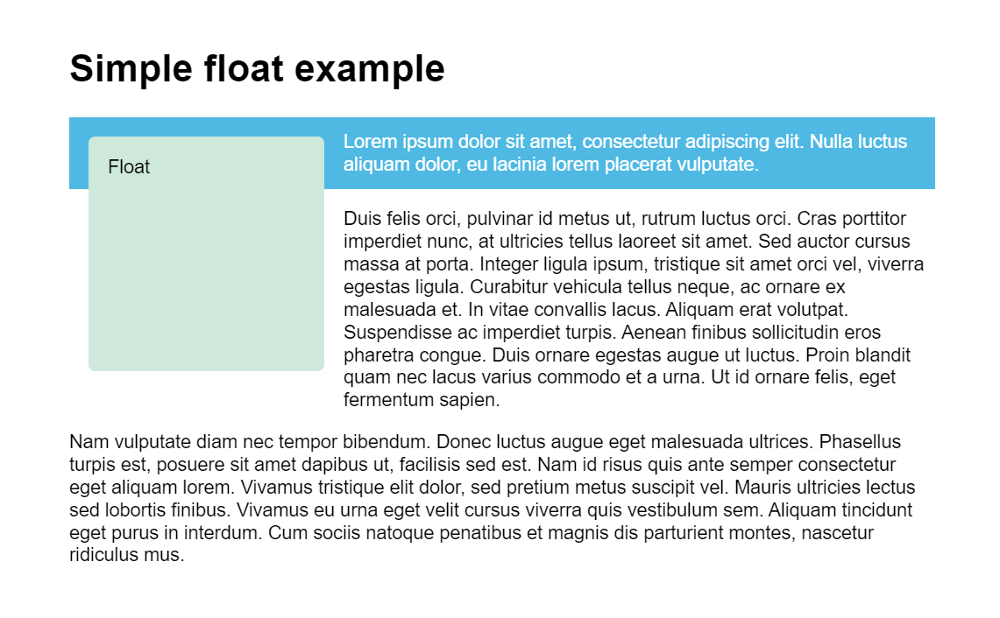

# **Layout**
## *Normal flow*
If nothing touched, HTML elements will be arranged from top to bottom (block elements) and left to right (inline elements). It's called normal flow.   
Layout technique let us arrange HTML elements out of normal flow. 

---
## *Float*
Block elements occupy all horizontal space even size of element is not that big.   
Float property limit occupation of an element only for its size and place it property value of its parent element. (left, right, top, bottom) So elements which have been under of it can be placed aside of it.   
Also it makes element literally floating like placed in another layer.   
Float declaration written
```CSS
float: left;
float: right;
float: top;
float: bottom;
```
For visualization see img below, 


*captured from MDN*

On img situation, if want to place first paragraph aside to float box but not second, use property ```clear```. Cleared element will ignore valued float property.   
Clear declaration written
```CSS
clear: left;
clear: right;
clear: both;
```
overflow는 content의 크기가 element의 크기를 넘어갈 때 표시하는 방식을 결정한다.

---
## *Position*
