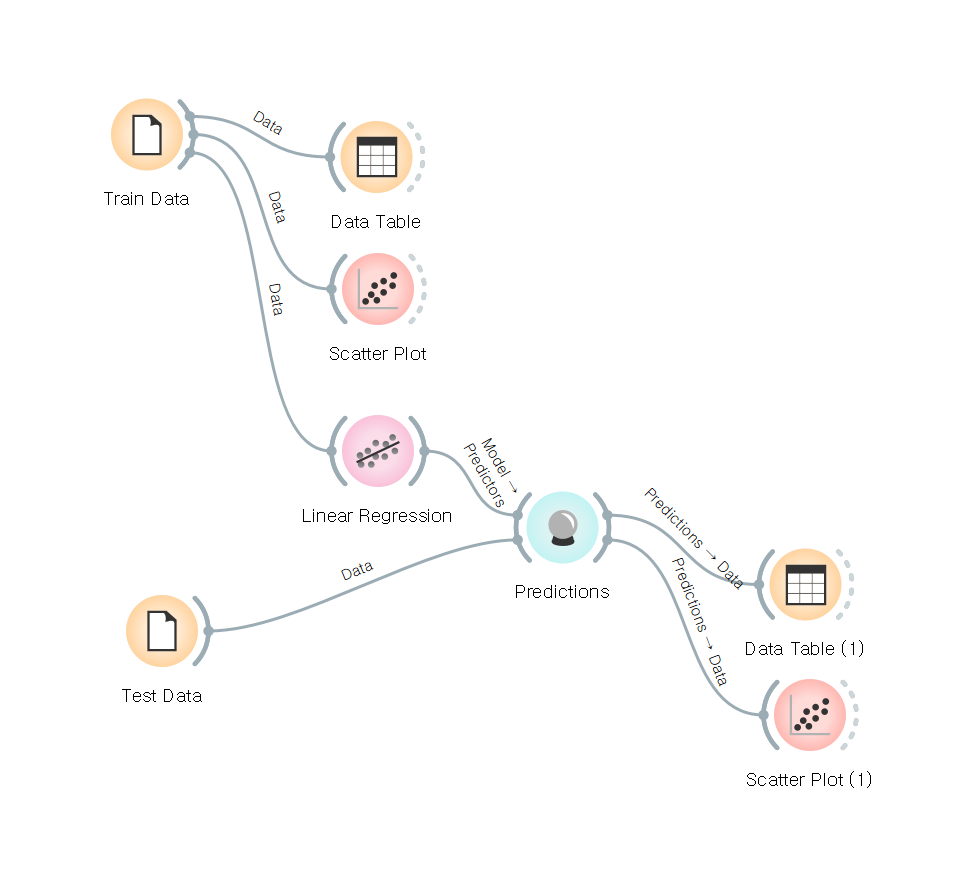

# **AI**
## *AI workload*
Machine Learning   
: Give data to machine, train them and extract algorithm.
- Supervised learning   
: Regression, predict value.   
Classification, classify data.

- Unsupervised learning   
: Train without label data,   
Clustering, classify data.

- Reinforcement learning

Anormaly Detection   
: Set boundary of normal data according to given data and detect anormal data.   

Computer Vision   
: Handling and understanding image or video data.   
- Image analysis   
- Image classification
- Object detection
- Face recognition
- OCR(Optical Character Recognition)

Natural Language Processing   
: Understand written or spoken language data.
- Written language: language detection, core phrase extraction, entity search, emotion read
- Spoken language: TTS(Text to speech), STT(Speech to text), translation

Conversational AI   
: Interactive AI, for example chatbot or AI speaker.

---
## *Basic flow of machine learning*

For machine learning, should prepare train data to train model and test data to evaluate it. Before training, using table or plot can check data.   
If data is ready, select or build a model(in this image Linear Regression) and train it.   
After train, using various metrics can evaluate model. Also using table or plot can visualize it.

---
## *Regression metrics*
- MAE(Mean Absolute Error)   
: average of absolute error(difference between predicted value and actual value)   
- MSE(Mean Square Error)   
: average of squared error
- RMSE(Root MSE)
- R2 Score

---
## *Classification metrics*
- Confusion matrix   
   
: A special layout that shows result of prediction. If value predicted match with actual value, use True. Else use False. Positive or nagative follows predicted values.

- Precision   
: TP / (TP + FP)
- Recall   
: TP / (TP + FN)   
- Accuracy(CA)   
: (TP + TN) / (TP + FP + FN + TN)   
- F1 Score   
: Harmonic mean of precision and recall   
- AUC   