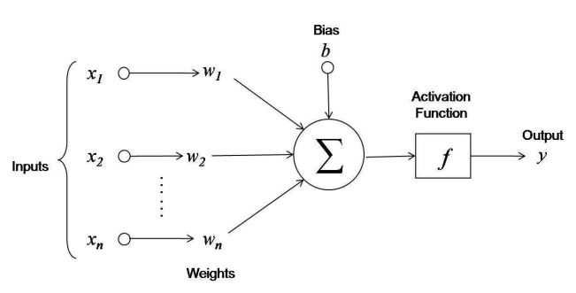
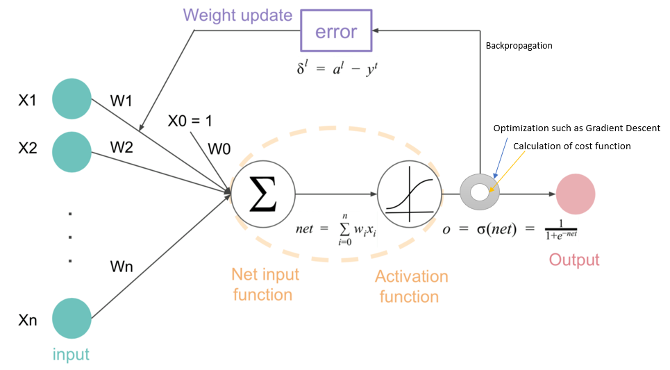

# **Deep Learning Process**
## *Build model*
There are 5 blocks that composing neural network - neuron, input, output, weight and bias.  
Neuron is decision maker. Neuron has one or more input and one output. Each input is not handled in same way. Neuron give different weight to each input and with bias send value to activation function. With this value, activation function make output. Output of one neuron can be input of other neuron.  

Layer is bundle of neurons. Except input and output layer, layers get input from previous layer and give output to following layer. 

---
## *Train model*
When output layer derive predicted value, using loss function and metric evaluate prdicted value and give score. MSE, RMSE, binary crossentropy, Categorical crossentropy are example of loss function. Loss function is also called cost function, error function or objective function.   

Deep learning is process of finding right weight and bias. After get loss score, model use optimizer to update weight and bias. These process called backpropagation.   

RMSProp and Adam is example of optimizer.

