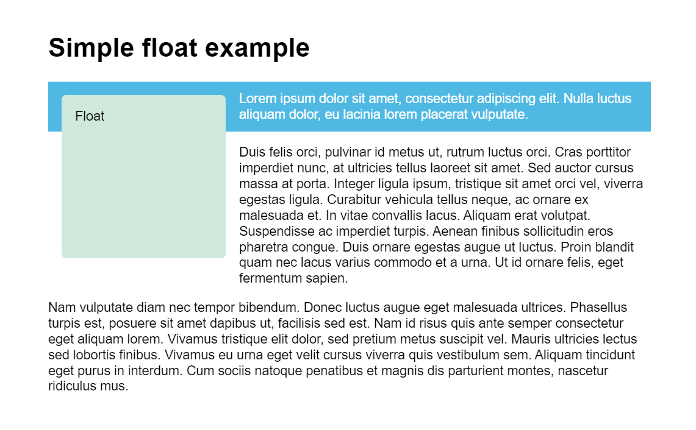

# **Layout**

## *Normal flow*
If nothing touched, HTML elements will be arranged from top to bottom (block elements) and left to right (inline elements). It's called normal flow.   
Layout technique let us arrange HTML elements out of normal flow. 

---
## *Float*
Block elements occupy all horizontal space even size of element is not that big.   
Float property limit occupation of an element only for its size and place it property value of its parent element. (left, right, top, bottom) So elements which have been under of it can be placed aside of it.   
Also it makes element literally floating like placed in another layer.   
Float declaration written
```CSS
float: left;
float: right;
float: top;
float: bottom;
```
For visualization see img below, 


*captured from MDN*

On img situation, if want to place first paragraph aside to float box but not second, use property ```clear```. Cleared element will ignore valued float property.   
Clear declaration written
```CSS
clear: left;
clear: right;
clear: both;
```
When contents of an element is to big to fit in element, use ```overflow``` to control how it to be seen.   
Overflow declaration written
```CSS
overflow: visible;
/* default value, show every contents */
overflow: hidden;
/* hide contents overed */
overflow: scroll;
/* make scroll for overed contents */
```
To use ```overflow:hidden;``` to block element can show background of its parent element.

---
## *Position*
Position property set position status of element.   
Written
```CSS
position: static;
/* default value */
position: relative;
position: absolute;
position: fixed;
```
Using property ```top, bottom, left, right``` can move elements. They move differently according to their position status.   
Should careful that those properties don't mean direction of move. They mean distance element away from reference point. For example ```top: 10px``` element is place 10px down from reference point.   

Each position status have different reference point.   
Static elements can't move. They are placed in normal flow.  
Relative elements move from their normal position.   
Absolute elements move from their closest parent element whose position is not static.   
Relative position is not used much for move, but make an element reference point for absolute position.   
Fixed elements move from viewport of browser. Fixed element can screen other elements behind.