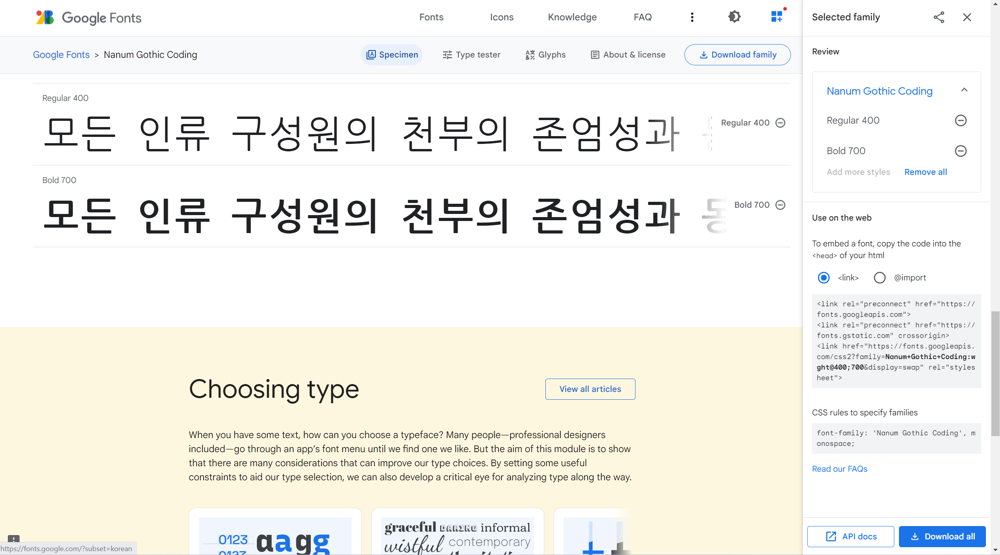

# **Apply Web Font**

## *Web font*
Though font setted for element, if there's no font file in device, font will not be applied.  
Using web font can solve this problem - link font file installed on server. If internet is connected, can provide the same result.   

Connect [google fonts](fonts.google.com) and select font want to use. (Regular 400 and Bold 700 on img below)   
Click 'View selected familes' button placed top-right.
(Blue button on img)   
Copy 'Use on the web' part and paste it into ```<head>```.   
Also can check CSS rule set for apply font.


*google font page*